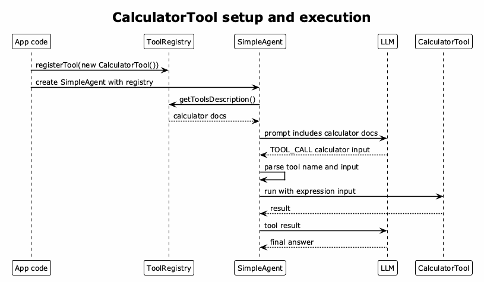

# Calculator Tool Flow

This diagram shows how the custom text-based tool loop works for
`CalculatorTool`.



[PlantUML source](./diagrams/calculator-tool-flow.puml)

The setup path is:

```txt
CalculatorTool -> ToolRegistry -> SimpleAgent -> system prompt -> LLM
```

The runtime path is:

```txt
user text -> LLM tool-call text -> parser -> local tool -> tool result -> final answer
```

In this custom approach, the model only knows about the calculator because
`SimpleAgent` writes the tool name, description, parameters, and call format into
the system prompt.
