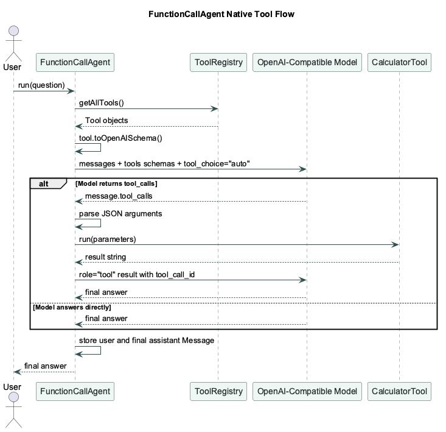

# Function Call Agent Flow

`FunctionCallAgent` uses OpenAI-compatible native function calling. The model
does not write a custom tool marker in normal text. Instead, the agent sends
structured tool schemas through the Chat Completions `tools` field, then reads
structured `message.tool_calls` from the response.



[PlantUML source](./diagrams/function-call-agent-flow.puml)

The setup path is:

```txt
Tool -> Tool.toOpenAISchema() -> tools field -> OpenAI-compatible model
```

The runtime path is:

```txt
user text -> model tool_calls -> local tool execution -> role="tool" result -> final answer
```

Use this when you want the model to decide whether a tool is needed, but you
want the tool name and arguments to come back as structured data instead of
free-form assistant text.

This schema is a guardrail, not a security boundary. The local tool code should
still validate inputs before doing anything risky.

