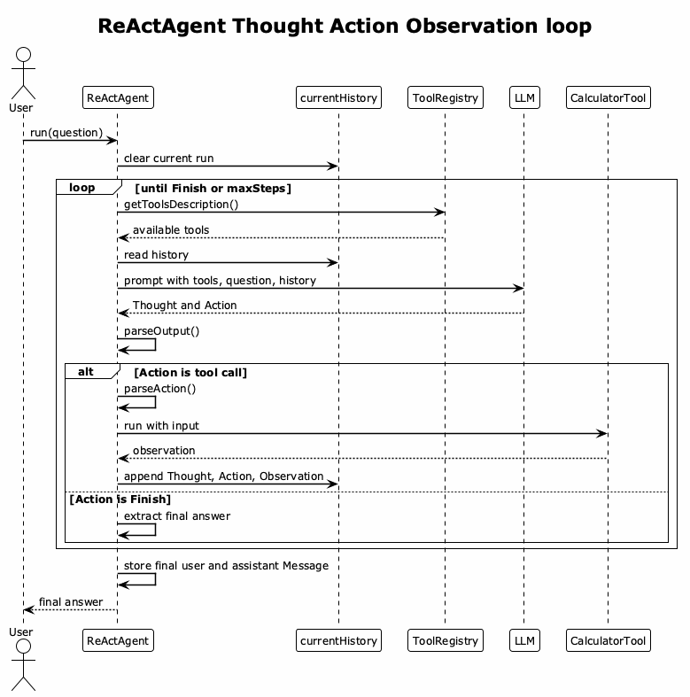

# ReAct Agent Flow

`ReActAgent` uses a ReAct-style loop: the model must produce one `Thought` and
one `Action` at a time. The action is either a tool call or `Finish[...]`.



[PlantUML source](./diagrams/react-agent-flow.puml)

The key difference from `SimpleAgent` is the scratchpad:

```txt
Thought: I should calculate the expression.
Action: calculator[5 + 10]
Observation: 15
Thought: I have the result.
Action: Finish[The answer is 15]
```

`currentHistory` stores this scratchpad for the active run. The base `history`
stores only final conversation messages after the run finishes.
