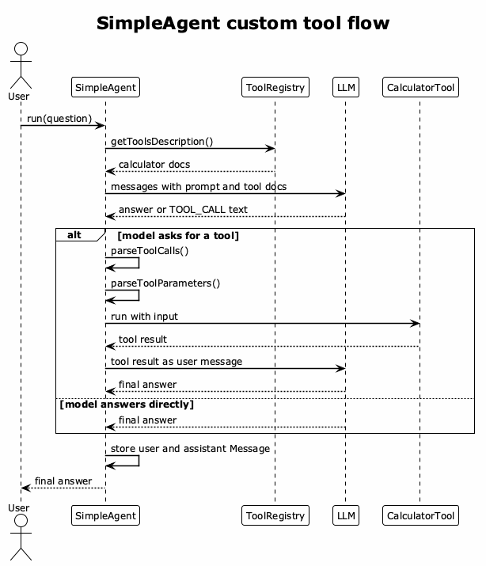

# Simple Agent Flow

`SimpleAgent` is the smaller agent. It builds one Chat Completions-style message
list, optionally lets the model request tools through custom text, and stores
the final user/assistant exchange in the base agent history.



[PlantUML source](./diagrams/simple-agent-flow.puml)

Use `SimpleAgent` when you want to learn the basic loop:

```txt
messages -> LLM -> optional tool call -> tool result -> final answer
```

The important detail is that tools are not passed through OpenAI's native
`tools` field. They are described in the system prompt, and the model writes
custom text such as:

```txt
[TOOL_CALL:calculator:input=12*8]
```
